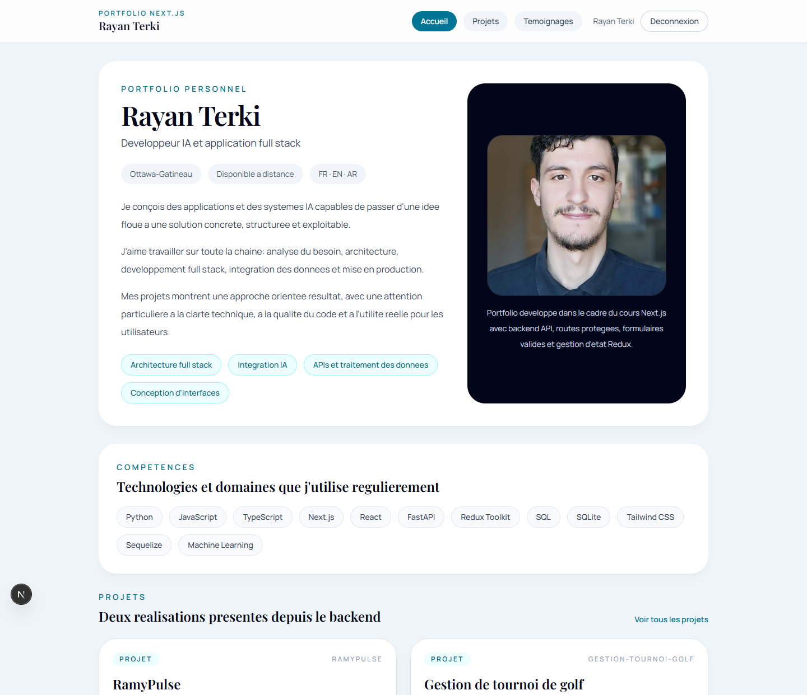
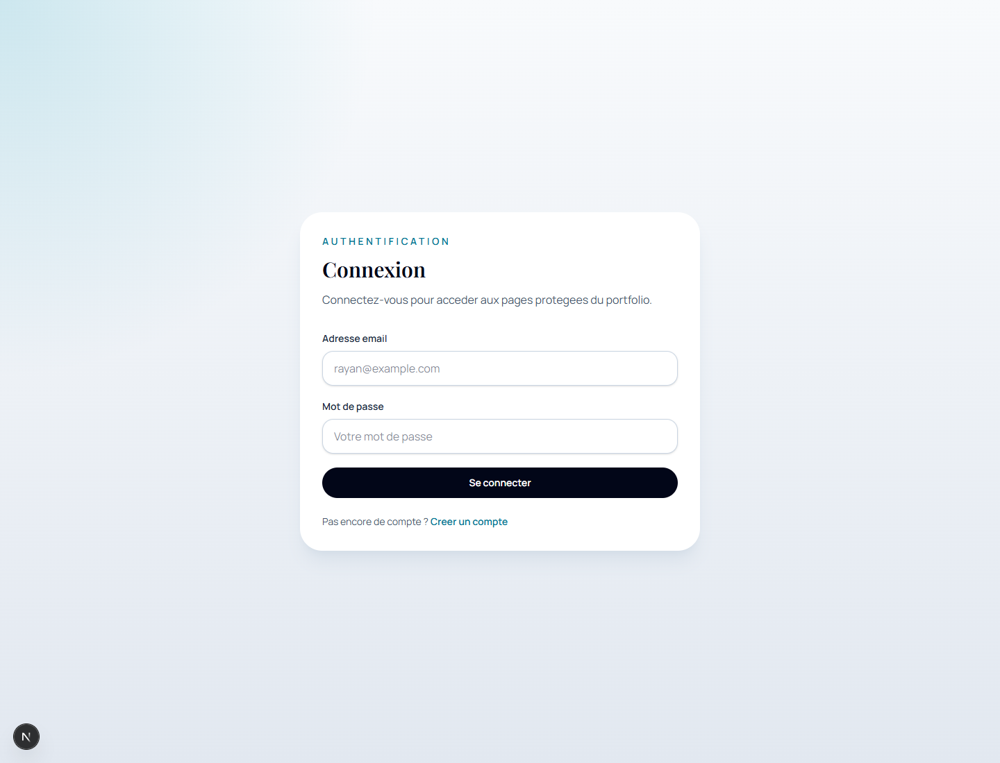
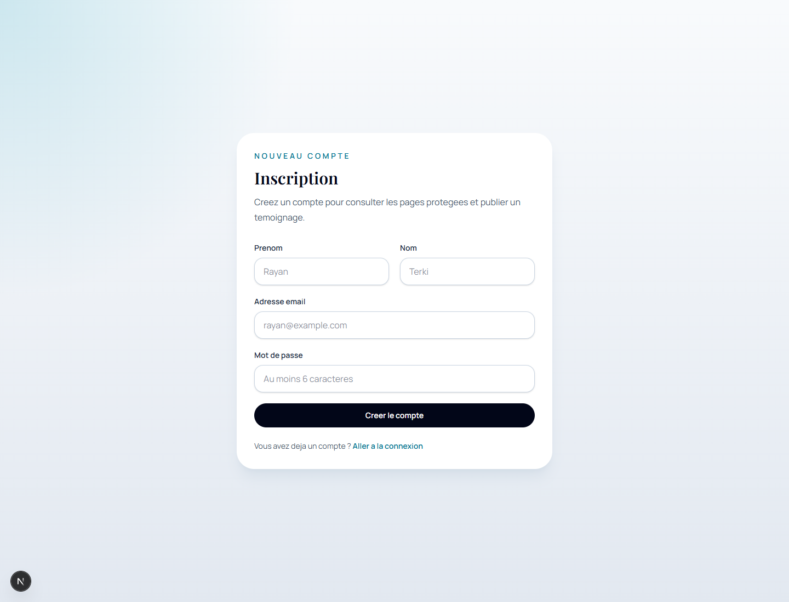
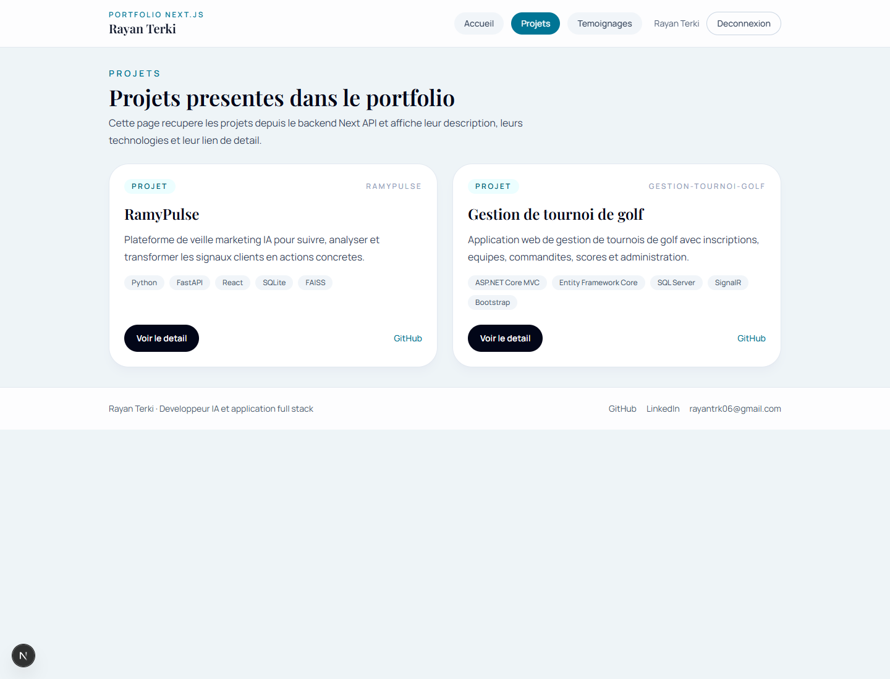
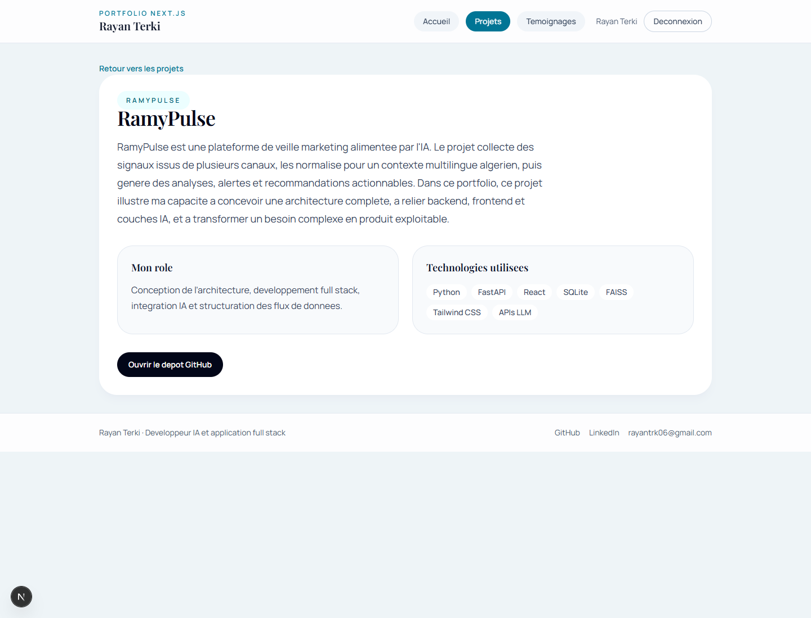
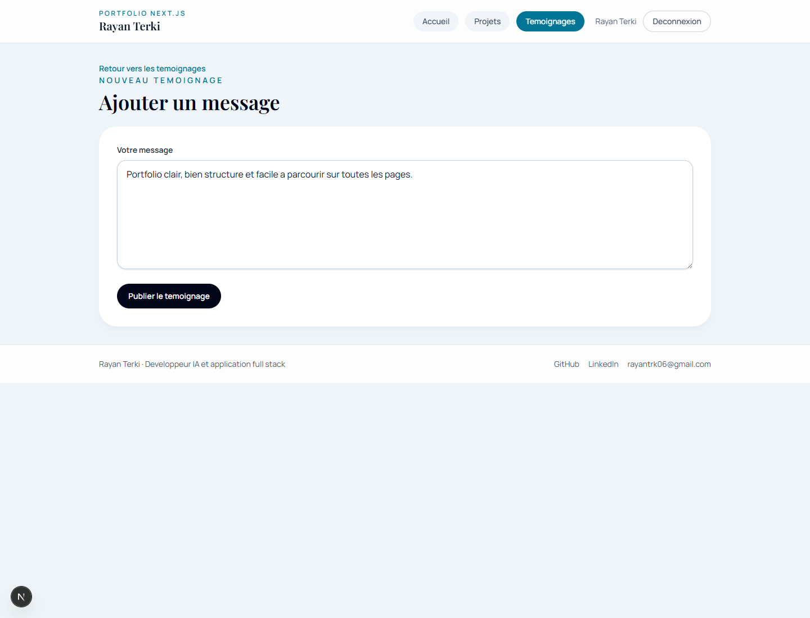
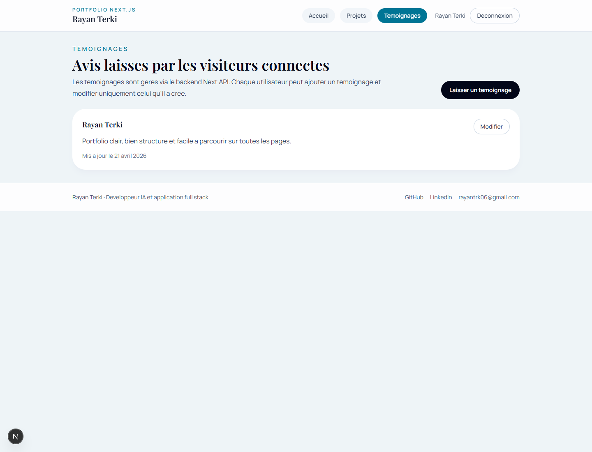

# Portfolio Next.js - Rayan Terki

Portfolio personnel realise avec `Next.js` dans le cadre du projet de conception demande au college. L'application presente mon profil, mes competences, deux projets, un systeme d'authentification complet et une section de temoignages reliee au backend `Next API`.

## Fonctionnalites

- page d'accueil protegee avec photo, presentation et competences
- header avec navigation et footer avec liens GitHub, LinkedIn et email
- page liste des projets
- page detail pour chaque projet
- page `inscription`
- page `login`
- page liste des temoignages
- page ajout de temoignage
- page modification de temoignage
- protection des routes avec `proxy.js`
- validation frontend et backend avec messages en rouge
- gestion d'etat avec `Redux Toolkit`
- communication frontend/backend avec `Axios`

## Projets presentes

### 1. RamyPulse

Plateforme de veille marketing IA qui collecte, normalise et analyse des signaux clients pour produire des alertes et recommandations actionnables.

Technologies principales :
- Python
- FastAPI
- React
- SQLite
- FAISS

Depot :
- <https://github.com/rayantr06/ramypulse>

### 2. Gestion de tournoi de golf

Application web de gestion de tournois de golf avec inscriptions, equipes, commandites, scores et administration.

Technologies principales :
- ASP.NET Core MVC
- Entity Framework Core
- SQL Server
- SignalR
- Bootstrap

Depot :
- <https://github.com/khenteurhanane/Gestion_Tournoi_Golf_G06>

## Stack technique du portfolio

- `Next.js 16`
- `React 19`
- `Redux Toolkit`
- `Axios`
- `Sequelize`
- `SQLite`
- `bcryptjs`
- `jsonwebtoken`
- `jose`
- `zod`
- `Tailwind CSS`
- `Vitest`

## Structure generale

```text
src/
  app/
    (public)/
      login/
      inscription/
    (protected)/
      projets/
      temoignages/
    api/
      auth/
      projects/
      testimonials/
  components/
  lib/
  models/
  store/
  validations/
```

## Installation

1. Cloner le depot

```bash
git clone https://github.com/rayantr06/Portfolio-.git
cd Portfolio-
```

2. Installer les dependances

```bash
npm install
```

3. Lancer le projet

```bash
npm run dev
```

4. Ouvrir l'application

```text
http://localhost:3000
```

## Tests et verification

Lancer les tests :

```bash
npm test
```

Verifier le lint :

```bash
npm run lint
```

Verifier le build :

```bash
npm run build
```

## Authentification

Toutes les pages sont protegees sauf :

- `/login`
- `/inscription`

Le token JWT est stocke dans un cookie `httpOnly` et verifie via `proxy.js`.

## Captures d'ecran

### Accueil



### Connexion



### Inscription



### Liste des projets



### Detail du projet RamyPulse



### Formulaire d'ajout de temoignage



### Liste des temoignages


